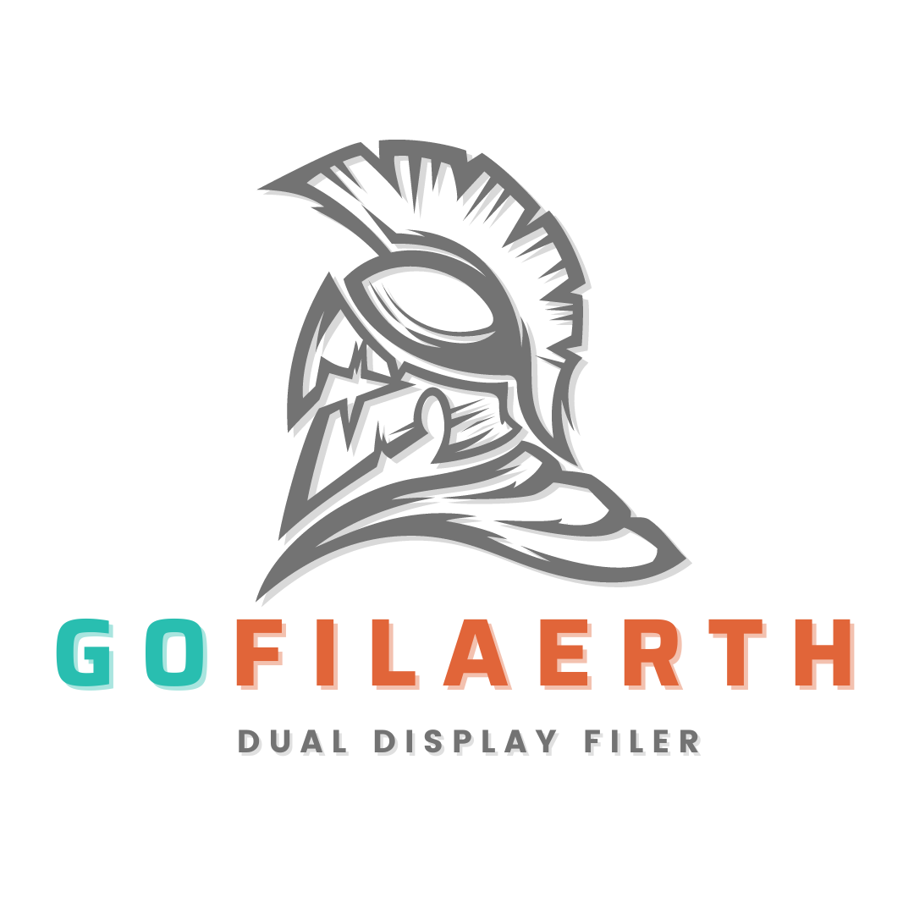

<p align="center">
   <br>
</p>


# GOFILERTH - TUI Dual Display Filer

[](https://github.com/harusame0616/GoFilerth/actions/workflows/fast-test.yml)


<font color="red">this is in the process of making.</font>

# Note
If the layout is broken, please set `LC_CTYPE` to `en_US.UTF-8`.

Run the following in your shell or write it in your shell profile (e.g. .bashrc)
```shell
export LC_CTYPE="en_US.UTF-8"
```


# Key Binding

| KEY | DESCRIBE                                                |
| --- | ------------------------------------------------------- |
| j   | Down the focused pane's cursor                          |
| k   | Up the focused pane's cursor                            |
| h   | Focus the left pane                                     |
| l   | Focus the right pane                                    |
| S   | Open the focused pane's directory with a shell ($SHELL) |
| e   | Open the focused pane's file with a editor ($EDITOR)    |